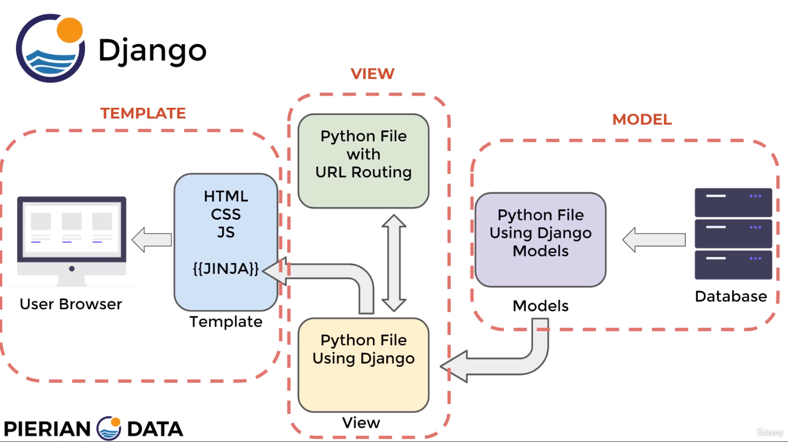
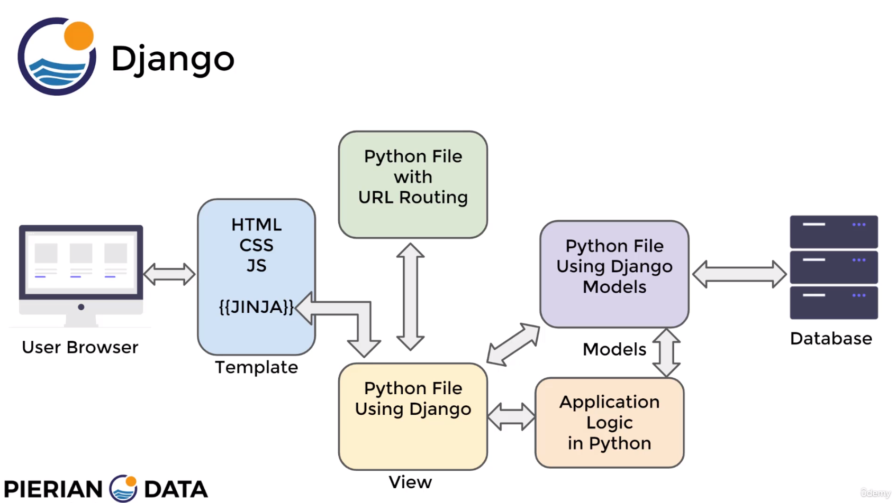

# Tabel of Contents
- [Tabel of Contents](#tabel-of-contents)
  - [Key Django Features](#key-django-features)
    - [**Additional features not shown in MTV structure above:**](#additional-features-not-shown-in-mtv-structure-above)
    - [**Django Drawbacks:**](#django-drawbacks)
  - [Django Project vs Django App:](#django-project-vs-django-app)
  - [Common Commands \& Code Snippets:](#common-commands--code-snippets)
  - [Views, Routing and URLs:](#views-routing-and-urls)
  - [Templates:](#templates)

 

## Key Django Features

- Model-Template-View (MTV) Structure
    - ORM - Object-relational Mapper
    - Models
    - URLs and Views
    - Templates
 
 

The basic MTV structure is as follows, with python picking up the serverside (back-end) section of the workflow.

 

Where using python comes into its own is by applying python logic that works in tandem with the mtv structure to bring additional features. E.g. machine learning algos working with the models etc.

### **Additional features not shown in MTV structure above:**
<ul>
    <li>Authentication</li>
    <li>Administration</li>
</ul>

### **Django Drawbacks:**

Django is heavily reliant on idea of a Model; i.e.  a representation of a table in a database. This makes it easy to query data but does mean that you need to understand Models and setting them up for views.

 

## Django Project vs Django App:

 

## Common Commands & Code Snippets:

Find code snippets [here](https://docs.google.com/spreadsheets/d/1Y5z9UxCh-aFkXUYMTqtE2UQR3YHjotAPrqOAKdQTkc0/edit#gid=1802607629)

## Views, Routing and URLs:

 

## Templates:

To connect a django app to a project - so that you can create a seperate templates section - you would follow the following steps:

1. Setup the Django App
   1. Create App Directory with `manage.py startapp <name_of_app>` comand
   2. Creaqte the relevant URLs and Views
   3. Mapp the app's URLs to the project
   
2. Run the migrate command
   * `python mange.py migrate`
   * Ths command looks inside the INSTALLED_APPS the settings and creates any necessary db tables
   
3. Inside of Django App check the apps.py file created automatically for you and register the AppConfig class to the ISTALLED_APPS inside of settings.py
   
4. Register the app and any db changes with Django by running:
   * `python manage.py makemigrations myapp`
   * Note, this is relevant only when models have been created.
   
5. Run `python manage.py migrate` again to create the model tables in our database.
   * Again, only relevant when we have created models.
   
6. Create a template directory inside your app directory with theis structure:
   * my_side
     * my_app
       * templates
         * my_app
           * example.html
   *  The second my_app folder is to ensure django doesn't choose a template with the same name that is actually associated with another app.

