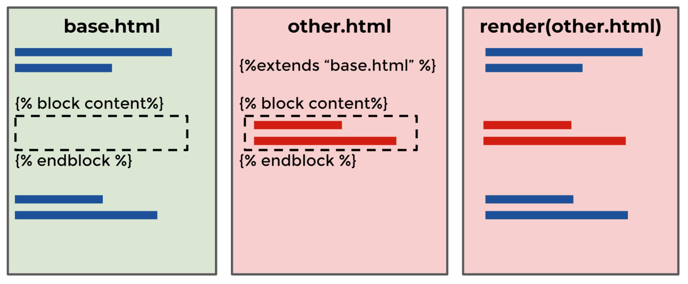
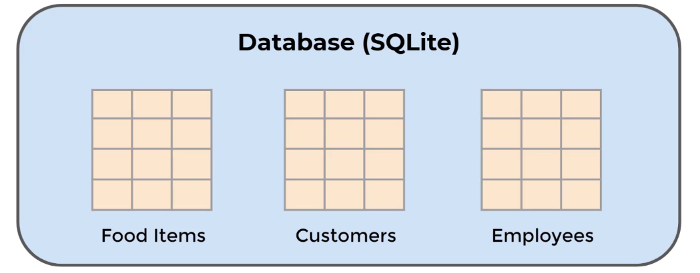
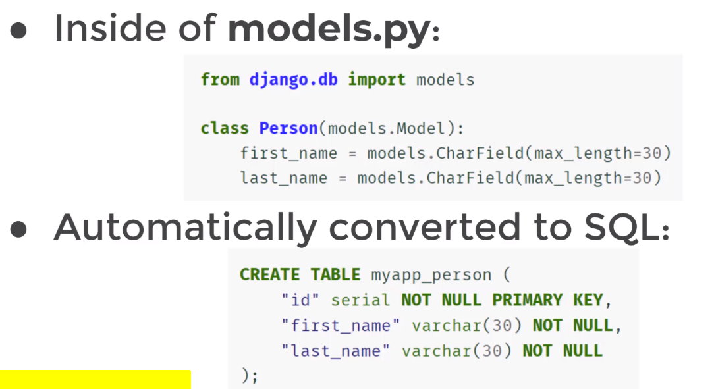
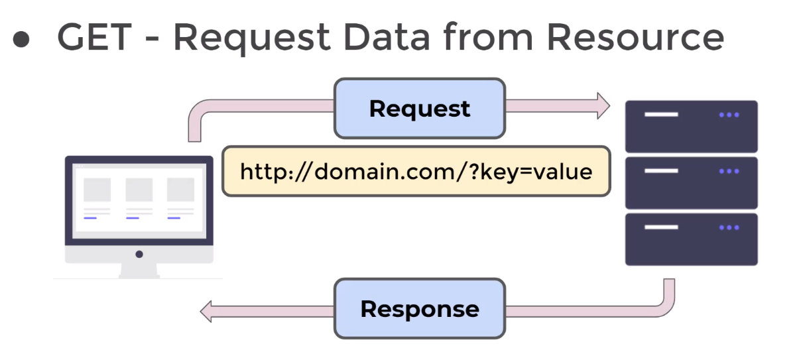
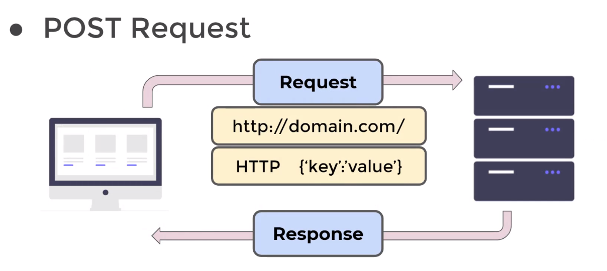
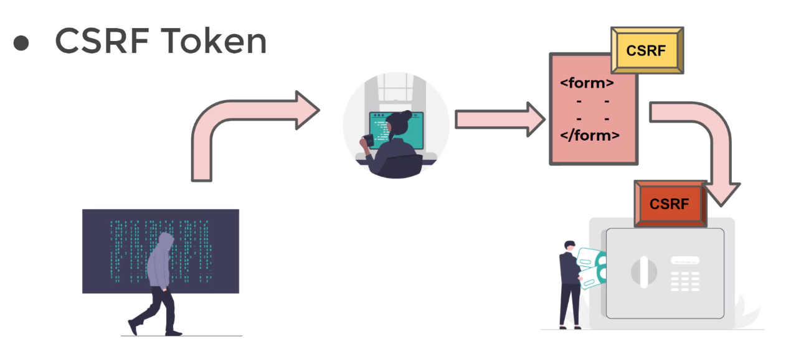

****# **Tabel of Contents**
- [**Common Commands \& Code Snippets:**](#common-commands--code-snippets)
- [**Key Django Features**](#key-django-features)
    - [**Additional features not shown in MTV structure above:**](#additional-features-not-shown-in-mtv-structure-above)
    - [**Django Drawbacks:**](#django-drawbacks)
- [**Django Project vs Django App:**](#django-project-vs-django-app)
- [**Views, Routing and URLs:**](#views-routing-and-urls)
    - [Simple Case](#simple-case)
- [**Templates:**](#templates)
- [**Passing variables into an html template / filters:**](#passing-variables-into-an-html-template--filters)
- [**Django Tags:**](#django-tags)
  - [**`for loops` tags:**](#for-loops-tags)
  - [**`if, elif and else` tags:**](#if-elif-and-else-tags)
  - [**Tags \& URL Names in Templates:**](#tags--url-names-in-templates)
      - [**Registering your app with django:**](#registering-your-app-with-django)
  - [**Block Tags - Template Inheritance:**](#block-tags---template-inheritance)
  - [**Customer Error Templates**](#customer-error-templates)
    - [**Making a custom error template with a different name**](#making-a-custom-error-template-with-a-different-name)
  - [**Static Files:**](#static-files)
- [**Models \& Fields:**](#models--fields)
  - [**Models Overview**](#models-overview)
    - [**Database Overview:**](#database-overview)
    - [**Models \& Databases**](#models--databases)
      - [**Django Model Key Concepts**](#django-model-key-concepts)
      - [**Connecting models to create relational databases**](#connecting-models-to-create-relational-databases)
  - [Database Engines:](#database-engines)
    - [**Setting up the DB with the `migrate` command**](#setting-up-the-db-with-the-migrate-command)
  - [Creating model fields:](#creating-model-fields)
    - [**Migrations:**](#migrations)
        - [**1. `python manage.py makemigrations app`**:](#1-python-managepy-makemigrations-app)
        - [**2. `python manage.py migrate`:**](#2-python-managepy-migrate)
        - [**3. `python manage.py slqmigrate`:**](#3-python-managepy-slqmigrate)
      - [**Steps for migrations:**](#steps-for-migrations)
  - [**Creating \& Inserting Data**](#creating--inserting-data)
    - [**Using The Terminal To Add Data**](#using-the-terminal-to-add-data)
      - [**Create Object and `.save()`**](#create-object-and-save)
      - [**`objects.create()`**](#objectscreate)
      - [**`objects.bulk_create()`**](#objectsbulk_create)
  - [**Reading and Querying the Database**:](#reading-and-querying-the-database)
    - [**Three Key Query Methods:**](#three-key-query-methods)
      - [**1. `.all()`:**](#1-all)
      - [**2. `.get()`:**](#2-get)
      - [**3.1 `.filter()`:**](#31-filter)
      - [**3.2 field lookups with a `.filter()` call:**](#32-field-lookups-with-a-filter-call)
      - [**4. ADDITIONAL METHODS**:](#4-additional-methods)
  - [**Updating Models:**](#updating-models)
  - [**Updating Entries:**](#updating-entries)
  - [**Deleting Items:**](#deleting-items)
  - [**Connecting Templates and Database Models:**](#connecting-templates-and-database-models)
- [**Django Admin**](#django-admin)
  - [**Creating a super-user:**](#creating-a-super-user)
  - [**Django Admin and Models:**](#django-admin-and-models)
    - [Registering model with Django admin:](#registering-model-with-django-admin)
    - [Creating customer admin pages:](#creating-customer-admin-pages)
- [**Django Forms:**](#django-forms)
  - [**GET, POST, and CSRF Overview:**](#get-post-and-csrf-overview)
    - [**HTTP Request Methods:**](#http-request-methods)
      - [**GET**](#get)
      - [**POST**](#post)
      - [**CSRF - Cross-Site Request Forgery - Fake HTML Forms**](#csrf---cross-site-request-forgery---fake-html-forms)
      - [**How to prevent a CSRF attack?**](#how-to-prevent-a-csrf-attack)
      - [**Creating CSRF tokens**](#creating-csrf-tokens)
  - [Django Form Class Basics:](#django-form-class-basics)


<br><br>

# **Common Commands & Code Snippets:**

Find code snippets [here](https://docs.google.com/spreadsheets/d/1Y5z9UxCh-aFkXUYMTqtE2UQR3YHjotAPrqOAKdQTkc0/edit#gid=1802607629)


<br><br>

# **Key Django Features**

- Model-Template-View (MTV) Structure
    - ORM - Object-relational Mapper
    - Models
    - URLs and Views
    - Templates
 
<br>

The basic MTV structure is as follows, with python picking up the server side (back-end) section of the workflow.


<br>

Where using python comes into its own is by applying python logic that works in tandem with the mtv structure to bring additional features. E.g. machine learning algos working with the models etc.


<br>

### **Additional features not shown in MTV structure above:**
  - Authentication
  - Administration

<br>

### **Django Drawbacks:**

  * Django is heavily reliant on idea of a Model; i.e.  a representation of a table in a database. This makes it easy to query data but does mean that you need to understand Models and setting them up for views.

<br><br>

# **Django Project vs Django App:**

  * Django is set up to take advantage of reusable 'apps' within their projects. This means that you can associate all of the required code, models etc. with the specific app that needs it an create a more organized project overall.


<br><br>

# **Views, Routing and URLs:**

### Simple Case
* Creating a simple view in a django app and connecting it to the main site takes three steps:

1. **Create a view within the target app:**
```
   from django.http import HttpResponse

   def simple_view(request):
      return HttpResponse('This is a simple view!')
```
<br>

2. **Add the path within the urls file of the app:**
```
   from django.urls import path
   from . import views

   urlpatterns = [
      path('', views.simple_view)
   ]
```
<br>

3. **Connects the main site's urls file to the apps urls file:**
```
   from django.contrib import admin
   from django.urls import path, include

   urlpatterns = [
      path('admin/', admin.site.urls),
      path('first_app/', include('first_app.urls')),
   ]
```

<br><br>

# **Templates:**

To connect a django app to a project - so that you can create a separate templates section - you would follow the following steps:

1. Setup the Django App
   1. Create App Directory with `manage.py startapp <name_of_app>` command
   2. Create the relevant URLs and Views
   3. Map the app's URLs to the project
   
2. Run the migrate command
   * `python mange.py migrate`
   * Ths command looks inside the INSTALLED_APPS the settings and creates any necessary db tables
   
3. Inside of Django App check the apps.py file created automatically for you and register the AppConfig class to the INSTALLED_APPS inside of settings.py
   
4. Register the app and any db changes with Django by running:
   * `python manage.py makemigrations myapp`
   * Note, this is relevant only when models have been created.
   
5. Run `python manage.py migrate` again to create the model tables in our database.
   * Again, only relevant when we have created models.
   
6. Create a template directory inside your app directory with this structure:
   * my_side
     * my_app
       * templates
         * my_app
           * example.html
   *  The second my_app folder is to ensure django doesn't choose a template with the same name that is actually associated with another app.

<br><br>

# **Passing variables into an html template / filters:**

   * When creating a view that renders to an html template, context can be parsed (rendered) to the template by adding in the 'context' argument. E.g. The following renders the the my_var dict to the variable.html template.

```
   def variable_view(request):

      my_var = {
         'first_name':'Jonny',
         'last_name':'Brownrigg',
         'some_list':['list item 1','list item 2','list item 3'],
         'some_dict':{'inside_key':'inside_value'},
      }

      return render(
         request,
         'my_app/variable.html',
         context=my_var,
         )
```
<br>

   * To use the values parsed to the template. You can use the {{}} notation. In addition, filters can be applied to perform certain 'python inspired' operations on the variables. E.g.

```
   <h1>VARIABLE.HTML</h1>
      <h2>Hello {{first_name}} {{last_name}}</h2>
      <h2>I have used an upper filter to print this name: {{first_name | upper}} {{last_name | upper}}</h2>
      <h2>And a length filter to print this name: {{first_name | length}} {{last_name | length}}</h2>
      <ol>
         <li>{{some_list.0}}</li>
         <li>{{some_list.1}}</li>
         <li>{{some_list.2}}</li>
      </ol>
```
<br>

   * To find more filters & tags - you can search for built in filters and tags in the django documentation. These can become quite complex, for instance grabbing the time that the user accesses something, date formatting or formatting an extract from a db to be consistent (e.g. upper).

<br><br>

# **Django Tags:**

   * Django tags are able to provide further logic at the template in the rendering process
     * This includes a lot of functionality, such as for loops, if-else statements and linking to URLs.

<br>

## **`for loops` tags:**

- for loop tags can be used to loop through items to create html elements such as lists and tables. E.g the following creates a simple ordered list from some_list or from some_dict.

```
   <ol>
      
         <li>{{item}}</li>
      
   </ol>

   <ul>
      
         <li>{{key}}: {{value}}</li>
      
   </ul>
```

- Many more tags can be found in the django documentation.
- When using these to create a table or list etc. reference the docs for best practice.

<br>

## **`if, elif and else` tags:**

- `if, elif and else` tags are extremely powerful due to the logic it allows. For example, by asking questions of the user (e.g. authenticated or not) different pages can be served.
- We can use boolean operators with `if, elif and else` tags. I.e. `==, or, and, not, >=` etc.

```
   
        <p>You are logged in, and your password is {{some_dict.password}}</p>
   
        <p>You are not logged in - your password cannot be displayed!</p>
   
```
- `for loops` and `if, elif and else` tags can be combined to perform more complex operations. E.g.
```
   <ul>
      
         
            <li>Two</li>
         
            <li>{{num}}</li>
         
      
   </ul>
```

<br><br>

## **Tags & URL Names in Templates:**

Links can be created using url names and the URL tag. To do this, you must first register your 'app' with django.

<br>

#### **Registering your app with django:**
- To register the app's namespace, you must add `app_name = <name_of_app>` to your app.urls file. It's best practice to name the app the same as it is in your file structure. Note, the variable must be called `app_name` so that django can find it. E.g. 

```
   from django.urls import path
   from . import views

   ''' Register the app namespace to be used to be used for URL names '''
   app_name = 'my_app'

   urlpatterns = [
      path('', views.example_view, name='example'),
      path('variable/', views.variable_view, name='variable')
   ]
```

Once the app is registered, a url tag with can  be used to create a link. E.g.

```
   <h2>
      <a href="">Click me to go to example view rendering the example.html template</a>
   </h2>
```

<br><br>

## **Block Tags - Template Inheritance:**

- To avoid repetition, template inheritance can be leveraged. I.e. Rather than recreating the html content for the top navigation bar or footer of a website on every html template, a block tag can be used.



For example:
1. Having registered a templates folder at the project level by adding the following to the settings.py file:

```
   TEMPLATES = [
      {
         'BACKEND': 'django.template.backends.django.DjangoTemplates',
         'DIRS': [os.path.join(BASE_DIR,'templates')],
         'APP_DIRS': True,
         'OPTIONS': {
               'context_processors': [
                  'django.template.context_processors.debug',
                  'django.template.context_processors.request',
                  'django.contrib.auth.context_processors.auth',
                  'django.contrib.messages.context_processors.messages',
               ],
         },
      },
   ]
```
2. You can create the following 'base' template in the templates folder. The block content tag shows the 'wrapper' that can go around other html templates.

```
   <html lang="en">
      <head>
         <meta charset="UTF-8">
         <meta http-equiv="X-UA-Compatible" content="IE=edge">
         <meta name="viewport" content="width=device-width, initial-scale=1.0">
         <title>Document</title>
      </head>
      <body>

         <h1>THIS IS ABOVE THE BLOCK IN BASE.HTML</h1>

         

         

         <h1>THIS IS BELOW THE BLOCK IN BASE.HTML</h1>
         

      </body>
   </html>
```

3. To inherit the template, you can then use the following code:

```
   

   

      <h1>Example html template</h1>
      <h1>Using URL names to link between app views</h1>
      <h2>
         <a href="">
               Click me to go to go back to the variable view rendering the variable.html template
         </a>
      </h2>

   
```

<br><br>

## **Customer Error Templates**

For custom error templates, it is likely that these will be at the project level. Therefore, would be placed in a project level template folder as above.

1. Create a custom template in the project level templates dir. E.g 404.html.
   - Note, to override a specific error. E.g. 404 you call the html 404.html and place it in the templates dir at the project level. Alternatively, you can do the following:  [link to later bit]
  
2. Turn DEBUG off in settings.py and add ALLOWED_HOSTS

```
# SECURITY WARNING: don't run with debug turned on in production!
DEBUG = False

ALLOWED_HOSTS = ['127.0.0.1']
```

### **Making a custom error template with a different name**

1. Create a project level views.py file. (I.e. in my_site) and create a view.

```
   from django.shortcuts import render

   def my_custom_page_not_found_view(request, exception):
      return render(request,'error_view.html',status=404)
```

2. Add the appropriate handler to the project level urls.py file. I.e.
   - Note, there are numerous handler[errorcode] options that can be viewed in the django docs.

```
   from django.contrib import admin
   from django.urls import path, include

   urlpatterns = [
      path('admin/', admin.site.urls),
      path('my_app/', include('my_app.urls'), name='admin')
   ]


   handler404 = 'my_site.views.my_custom_page_not_found_view'
```

## **Static Files:**
- Most projects will have static files such as images, js or CSS.
- Django can serve these static files through tags instead of using full file path
- The following is a generic method to let your template know the location of any static files.

1. Ensure that static files are installed under the INSTALLED_APPS settings within settings.py. Note this should be there by default.

```
   INSTALLED_APPS = [
      'my_app.apps.MyAppConfig', #added new app
      'django.contrib.admin',
      'django.contrib.auth',
      'django.contrib.contenttypes',
      'django.contrib.sessions',
      'django.contrib.messages',
      'django.contrib.staticfiles',
]
```

2. Ensure that the static url is defined in settings.py. I.e.

```
   # Static files (CSS, JavaScript, Images)
   # https://docs.djangoproject.com/en/4.2/howto/static-files/

   STATIC_URL = 'static/'
```

3. Create a directory called 'static' under and place your static files in there. I.e.
   - my_site/my_app/static/my_app/

4. You can then use the static files as follows:
   - Note, some times you will need to restart the server to view the static files.

```
   

   

   

      <h1>Example html template</h1>
      <h1>Using URL names to link between app views</h1>
      <h2>
         <a href="">
               Click me to go to go back to the variable view rendering the variable.html template
         </a>
      </h2>

      <h1>HOW TO MAKE USE OF STATIC:</h1>

      

   
```

<br><br>


# **Models & Fields:**

## **Models Overview**

- Models allow us to interact with a database with Python and Django.
- This includes CRUD operations:
  - Create
  - Read
  - Update
  - Delete
- THis section will explore how to store, retrieve, update and delete data from SQL based DBs using django's built in models tools and functionality.

<br>

### **Database Overview:**

- SQL databases are tabular. I.e. relational data bases.
- NoSQL databases are stored in a key/value pair format.
- Django models are designed to work well with SQL type DBs and so we will focus primarily on them
  - Additional packages can be installed to support NoSQL databases such as MongoDB.

<br>

### **Models & Databases**

- Django models are defined inside a Django app (or proj) models.py file
- THe models class operates on a system which directly converts Python based code into SQL commands.
- Creating a single Model is similar to creating a new table in a DB. Relationships can then be drawn between the DBs various tables.



<br>

- Each DB table has a name and columns, where each column has a specific data type.

#### **Django Model Key Concepts**

- **Inherits from the models class**
- **Uses fields to define both data types and data constraints**
  - for example, you may want to require information, like user's email address, in which case you can add a `NOT NULL` constraint. E.g.



#### **Connecting models to create relational databases**

- Models can be connected through keys. E.g.


## Database Engines:

- By default the database `ENGINE` is set as sqlite3, which is included in a python installation.
- The `NAME` component provides a path to the database.

```
   # Database
   # https://docs.djangoproject.com/en/4.2/ref/settings/#databases

   DATABASES = {
      'default': {
         'ENGINE': 'django.db.backends.sqlite3',
         'NAME': BASE_DIR / 'db.sqlite3',
      }
   }
```
- The SQL `ENGINE` can be swapped out easily by following the [documentation guidance](https://docs.djangoproject.com/en/4.2/ref/settings/#databases)

- Several database types are supported 'Out of the box' - assuming you have the correct DB files installed. E.g.
  - Postgres
  - mysql
  - sqlite3
  - oracle
- However, additional DBs cab be used by installing additional third party libs. (See databases section of docs for more details)

### **Setting up the DB with the `migrate` command**
- When initializing a project, you will notice that there is no db.sqlite3 file visible
- To set up the database (in this case the sqlite3 db), you first need to make sure any apps are registered in the installed apps section of settings.py and then rune the migrate command. That is, in the terminal:
    - `python manage.py migrate`

## Creating model fields:

- Models can be created through inheritance of django's core models. I.e.
  - In the apps models.py file, you can create a class (which will ultimately create a DB table) and inherit from `models.Model`. E.g.

```
   from django.db import models

   # Create your models here.
   class Patient(models.Model):
      first_name = models.CharField(max_length=30)
      last_name = models.CharField(max_length=30)
      age = models.IntegerField()
```

<br><br>

### **Migrations:**
Migrations is the act of connecting changes in your Django project or app to the database. For instance:
  - Adding new models models
  - Adding new applications
  - Updating models with a new column/ attribute; etc.

These changes are typically done through the `manage.py` file through three main commands:

##### **1. `python manage.py makemigrations app`**:
   - Creates the set of instructions that will apply changes to the database
   - Default apps (admin, auth etc.) have already had their sql migrations code created. Hence, sometimes you need to run them right off the bat.
   - When you run the `makemigrations` cmd, a file with these migrations is created in:
     - app
       - migrations
         - 000n_initial.py

##### **2. `python manage.py migrate`:**
   - Runs existing migrations created through `makemigrations`. I.e. the files under the migrations dir.
   - You can think of the very fist `migrate` command you run as executing the default `makemigrations` that were created when creating the project. 

##### **3. `python manage.py slqmigrate`:**
   - If you have already run `makemigrations` cmd and created a migration.py file, the `sqlmigrate` cmd allows you to view the sql code looks like.

#### **Steps for migrations:**
1. Initial project `migrate` cmd
2. Create app and create models
3. Register app in INSTALLED_APPS in settings.py:
   1. Find the app name by looking in:
         - my_site
           - [apps.py]
             - apps.py
               - [ClassName] e.g. 'OfficeConfig' for the office app I created in the learning environment
   2. Register it:

```
   INSTALLED_APPS = [
      'office.apps.OfficeConfig',
      'django.contrib.admin',
      'django.contrib.auth',
      'django.contrib.contenttypes',
      'django.contrib.sessions',
      'django.contrib.messages',
      'django.contrib.staticfiles',    
   ]
```
4. Run `make migrations` for the new app
   - `python manage.py makemigrations [appname]`

5. **OPTIONAL** view sql commands:
   - `python manage.py sqlmigrate [app_name] [migrations_file_num]` E.g.
     - `python manage.py sqlmigrate office 0001`
   - The above prints this to the terminal, could print this to file using bash cmd echo and > to put into file to send to others

6. Run `migrate` to execute migrations
   - `python manage.py migrate`

<br><br>

## **Creating & Inserting Data**
   - Inserting data into django can be done by creating a new instance of a model class, seeing as django models are represented classes, and then call the .`save()` method on it to create an INSERT call to the SQL db
   - Alt. You can use the `.objects.create()` method to create and save in a single line
   - In instances where you want to create multiple data entries in 'bulk', you can use the `.objects.bulk_create()` method to pass in a list of newly created objects

### **Using The Terminal To Add Data**
- An interactive shell can be opened using the `shell` command. I.e.
  - `python manage.py shell`

#### **Create Object and `.save()`**
- You can create data directly in the terminal by:
  1. Opening an InteractiveConsole in the terminal
      - `python manage.py shell`
  2. Importing model:
      - `from app.models import Model`
  3. Creating a model object:
      - `object = Model(**kargs)
      - Note, at this point you can explore the object before saving it to the DB.
  4. Saving the object to write it to the DB.
      - `object.save()`
      - Note, the `.save()` method is inherited from the `models.Model` class

```
   Bash $ python manage.py shell

   Python 3.10.6 (main, May 29 2023, 11:10:38) [GCC 11.3.0] on linux
   Type "help", "copyright", "credits" or "license" for more information.
   (InteractiveConsole)
   >>> 
   >>> from office.models import Patient
   >>> 
   >>> anna_webb = Patient(first_name='Anna', last_name='Webb', age= 24)
   >>> 
   >>> anna_webb.save()
```


#### **`objects.create()`**

- The above can be done in one step using:
  - `Model.objects.create(**kwags)`

```
   >>> from office.models import Patient
   >>> 
   >>> Patient.objects.create(first_name='Zac', last_name='Brown', age=34)
   <Patient: Brown, Zac is 34 years old.>
```


#### **`objects.bulk_create()`**

1. Import Models
2. Create list (`my_list`) of model objects
3. use `Model.objects.bulk_create(my_list)` to write to DB

```
   >>> from office.models import Patient
   >>> 
   >>> my_list = [Patient(first_name='Tom', last_name='Paine', age=19), Patient(first_name='Bob', last_name='Dice', age=62)]
   >>> 
   >>> Patient.objects.bulk_create(my_list)
   [<Patient: Paine, Tom is 19 years old.>, <Patient: Dice, Bob is 62 years old.>]
```

<br><br>

## **Reading and Querying the Database**:

- Each model you create comes with a **Manager** (Django Model Manager) that allows you to create a **QuerySet** which can then be used to retrieve entries from the DB.
  - The model manager is: `MyModel.objects`, as used when creating data
- **QuerySets** are lazily evaluated, meaning that they don't hit the database until it is explicitly asked to grab info
- The manager allows you to read the database through the use of method calls. E.g.
  
[Good Reference Material for Queries](docs.djangoproject.com/en/4.0/topics/db/queries/)

### **Three Key Query Methods:**

#### **1. `.all()`:**

```
   >>> Patient.objects.all()
   <QuerySet [<Patient: Doe, John is 30 years old.>, <Patient: Doe, Jane is 43 years old.>, <Patient: Man, Old is 75 years old.>, <Patient: Fring, Nancy is 12 years old.>, <Patient: Holly, Buddy is 95 years old.>]>
   >>> 
   >>> Patient.objects.all()[0]
   <Patient: Doe, John is 30 years old.>
```

   - Special dunder methods can be created as a model method to do things such as print a human readable version of the model object. E.g. to create the string above:

```
   class Patient(models.Model):
      first_name = models.CharField(max_length=30)
      last_name = models.CharField(max_length=30)
      age = models.IntegerField()

      def __str__(self):
         return f"{self.last_name}, {self.first_name} is {self.age} years old."
```

#### **2. `.get()`:**
   - Allows us to grab a single item from the Model table
   - Typically reserved for when returning a single unique entry, like the default primary key (`pk=n`).
     - Note, in sql, the primary key starts at index 1

```
   >>> Patient.objects.get(pk=1)
   <Patient: Doe, John is 30 years old.>
```

#### **3.1 `.filter()`:**
   - As opposed to `.get()`, the filter method narrows down based on conditions.
   - Filter methods can be chained together.
   - Note, operators (`AND`, `OR`)can be imported from `django.db.models` from the Q function.
   - `<` and `>` (and variations of) are not available using this method of filtering.

```
   >>> from django.db.models import Q
   >>> 
   >>> Patient.objects.filter(last_name="Doe").filter(age=30).all()
   <QuerySet [<Patient: Doe, John is 30 years old.>]>
   >>> 
   >>> Patient.objects.filter(Q(last_name='Doe') & Q(age=30) | Q(age=43)).all()
   <QuerySet [<Patient: Doe, John is 30 years old.>, <Patient: Doe, Jane is 43 years old.>]>
```

#### **3.2 field lookups with a `.filter()` call:**
More complex filtering operations can be created using field lookups. E.g.
- `Model.objects.filter(name__startswith="s")`
- [See full list of field lookups here](https://docs.djangoproject.com/en/4.2/ref/models/querysets/#field-lookups)


```
   >>> from office.models import Patient
   >>> 
   >>> Patient.objects.filter(last_name__startswith="D").all()
   <QuerySet [<Patient: Doe, John is 30 years old.>, <Patient: Doe, Jane is 43 years old.>]>
   >>> 
   >>> Patient.objects.filter(age__in=[x for x in range(30,40)]).all()
   <QuerySet [<Patient: Doe, John is 30 years old.>]>
   >>> 
   >>> Patient.objects.filter(age__gte=40).all()
   <QuerySet [<Patient: Doe, Jane is 43 years old.>, <Patient: Man, Old is 75 years old.>, <Patient: Holly, Buddy is 95 years old.>]>
```

#### **4. ADDITIONAL METHODS**:
There are **many many** more methods to help with extracting, filtering etc. in the django documentation. This includes functionality such as being able to sort your data. Please view the docs for more info:
- [Additional methods can be found in the right hand pane](https://docs.djangoproject.com/en/4.2/ref/models/querysets/#field-lookups)

e.g.
```
   >>> from office.models import Patient
   >>> 
   >>> Patient.objects.order_by('age').all()
   <QuerySet [<Patient: Fring, Nancy is 12 years old.>, <Patient: Doe, John is 30 years old.>, <Patient: Doe, Jane is 43 years old.>, <Patient: Man, Old is 75 years old.>, <Patient: Holly, Buddy is 95 years old.>]>
```

<br><br>

## **Updating Models:**

- To update models, you can simply add a new model class attribute and then migrate the changes.
- Note, when adding a new field - a default value must be inserted for existing entries, even if it is just `null`
  - In fact, if we run migrations without taking care of these issues, Django will specifically request us to make a decision.
  - You'd typically be given two options: 1. To create a default value on the spot, or 2. Cancel migrations and create a default value within the model itself.

```
   $ python manage.py makemigrations office
   It is impossible to add a non-nullable field 'heart_rate' to patient without specifying a default. This is because the database needs something to populate existing rows.
   Please select a fix:
   1) Provide a one-off default now (will be set on all existing rows with a null value for this column)
   2) Quit and manually define a default value in models.py.
   Select an option: 
```

- Validators can also be used to a hard-coded constraints that will reject non-valid entries. Note, you will need to import the validators from `django.core.validators`

```
   from django.db import models
   from django.core.validators import MaxValueValidator, MinValueValidator

   # Create your models here.
   class Patient(models.Model):
      first_name = models.CharField(max_length=30)
      last_name = models.CharField(max_length=30)
      age = models.IntegerField(validators=[
                                 MinValueValidator(0),
                                 MaxValueValidator(120),
                                 ])
      heart_rate = models.IntegerField(default=60,
                                       validators=[
                                          MinValueValidator(1),
                                          MaxValueValidator(350),    
                                       ])
```

<br><br>

## **Updating Entries:**

- Django makes it very easy to update DB entries, you simply grab the existing data entry and update any attributes, them call `.save()` to write the changes to the DB. E.g.

```
   >>> from office.models import Patient
   >>> 
   >>> Patient.objects.get(pk=1)
   <Patient: Doe, John is 30 years old.>
   >>> 
   >>> john = Patient.objects.get(pk=1)
   >>> 
   >>> john
   <Patient: Doe, John is 30 years old.>
   >>> 
   >>> john.last_name = 'Smith'
   >>> 
   >>> john
   <Patient: Smith, John is 30 years old.>
   >>> 
   >>> john.save()
   >>> 
   >>> Patient.objects.all()
   <QuerySet [<Patient: Smith, John is 30 years old.>, <Patient: Doe, Jane is 43 years old.>, <Patient: Man, Old is 75 years old.>, <Patient: Fring, Nancy is 12 years old.>, <Patient: Holly, Buddy is 95 years old.>, <Patient: Paine, Tom is 19 years old.>, <Patient: Dice, Bob is 62 years old.>, <Patient: Brown, Zac is 34 years old.>, <Patient: Webb, Anna is 24 years old.>]>
```

<br><br>

## **Deleting Items:**

- To delete items it's as simple as calling `.delete()` on the item to be removed. e.g.

```
   >>> from office.models import Patient
   >>> 
   >>> Patient.objects.get(pk=1)
   <Patient: Doe, John is 30 years old.>
   >>> 
   >>> john = Patient.objects.get(pk=1)
   >>> 
   >>> john
   <Patient: Doe, John is 30 years old.>
   >>> 
   >>> john.last_name = 'Smith'
   >>> 
   >>> john
   <Patient: Smith, John is 30 years old.>
   >>> 
   >>> john.save()
   >>> 
   >>> Patient.objects.all()
   <QuerySet [<Patient: Smith, John is 30 years old.>, <Patient: Doe, Jane is 43 years old.>, <Patient: Man, Old is 75 years old.>, <Patient: Fring, Nancy is 12 years old.>, <Patient: Holly, Buddy is 95 years old.>, <Patient: Paine, Tom is 19 years old.>, <Patient: Dice, Bob is 62 years old.>, <Patient: Brown, Zac is 34 years old.>, <Patient: Webb, Anna is 24 years old.>]>
```

## **Connecting Templates and Database Models:**

- This section will explore reporting information back from the DB to templates, however, bare in mind that we are yet to cover two extremely powerful (Django Forms and Class Based Views) that will save us a ton of dev time.
- That said, lets show a simple example of a template that could be used to report back information from a database.

The following shows an example of how you could connect database data to a template - but isn't necessarily how you should do it all the time! (consider Forms and Class Based Views):


   - Project level urls:
      ```
         from django.contrib import admin
         from django.urls import path, include

         urlpatterns = [
            path('admin/', admin.site.urls),
            path('office/', include('office.urls')),
            ]
      ```

   - Application level urls:
      ```
         from django.urls import path
         from . import views

         urlpatterns = [
            path('', views.list_patients, name='list_patients')
         ]
      ```

   - Application View:
      ```
         from django.shortcuts import render
         from . import models

         # Create your views here.
         def list_patients(request):

            all_patients = models.Patient.objects.all()
            context = {'patients':all_patients}
            
            return render(request, 'office/list.html', context=context)
      ```

   - html Template:
      ```
         <html lang="en">
         <head>
            <meta charset="UTF-8">
            <meta name="viewport" content="width=
            , initial-scale=1.0">
            <title>Document</title>
         </head>
         <body>
            
            <ul>
            
               <li>{{person}}</li>
            
            </ul>

         </body>
         </html>
      ```

<br><br>

# **Django Admin**

**Created my_car_site project using everything learnt so far**

- You can navigate to the Django Admin page associated with your website by going to `domain_name/admin`

## **Creating a super-user:**

- You can use the CLI to create a super user. I.e.

   ```
      python manage.py createsuperuser
      Username (leave blank to use 'jonny'): jonny_admin
      Email address: jonny@example.com
      Password: 
      Password (again): 
      Superuser created successfully.
   ```
- Once created, the above super user would be able to access the admin page

## **Django Admin and Models:**
   - Let's explore registering models to the django admin interface; and,
   - Look at how the `ModelAdmin` class can provide us with additional functionality with the fields presented in the Admin interface.

### Registering model with Django admin:

   - To register a model with django admin you must update the app's admin.py file by:
      1. Importing the model to be registered. e.g.
         - `from app.models import Model`
         - Note that `.models` would work too but by convention `app.model` is used.
      2. Using `admin.site.register(Model)` to register the model.

   ```
      from django.contrib import admin
      from cars.models import Car

      # Register your models here.

      admin.site.register(Car)
   ```

### Creating customer admin pages:
   - as with above you can use the app's admin.py file to create a custom admin page.
   - To do this you must:
      1. import the model as before
      2. Create a custom class that inherits from `admin.ModelAdmin`
      3. Define your functionality
      4. register the admin model with `admin.site.register(Car, CarAdmin)`

   ```
      from django.contrib import admin
      from cars.models import Car

      # Register your models here.

      class CarAdmin(admin.ModelAdmin):
         fields = ['year', 'brand'] # defines order of fields

      admin.site.register(Car,CarAdmin)
   ```
   
   or

   ```
      from django.contrib import admin
      from cars.models import Car

      # Register your models here.

      class CarAdmin(admin.ModelAdmin):
         # creates subsections:
         fieldsets = [
            ('CAR INFO', {'fields':['brand']}),
            ('YEAR INFO', {'fields':['year']})
         ]

      admin.site.register(Car,CarAdmin)
   ```

<br><br>

# **Django Forms:**
- HTML forms are extremely common across the internet.
- Fortunately, Django comes with a built-in Forms class which can be used with django and python to create forms and send that form to the template through a simple Tag call `{{form}}`.

## **GET, POST, and CSRF Overview:**
- HTTP (Hypertext Transfer Protocol) is the foundation for the method of sending and receiving data over the world wide web.
- Recall, HTTPS is simply and encrypted version of HTTP

### **HTTP Request Methods:**
#### **GET**
- Requests data from a specified resource
- *This is the default form method!*



- The GET request is sent in the URL. Hence:
  - GET requests can be bookmarked
  - GET requests are saved in history
  - GET request can be cached
  - GET request has length limits
- GET request can only request data, not modify or update it.

#### **POST**
- Requests to send data to a server to create/ update a resource



- Information is no longer sent through the url, and now is instead sent in the body of the http request.
- You still get a response back!

#### **CSRF - Cross-Site Request Forgery - Fake HTML Forms**

- Consider a bank's website that have an html form that transfers money.
- If a hacker created a forgery of the html form the could edit key components. E.g. who is sending money.
- They would then initiate some form of phishing scam (e.g. by email) to tick a user into sending this form request that would go to the bank, causing them to send money believing its a legitimacy

- CRSF - Essentially a hacker creates a forgery of an html form and then uses someone else to perform the malicious action across the sites.

#### **How to prevent a CSRF attack?**
- Generate a random cryptographic token with every form during each individual session
  - the server can then confirm if the token matches with the current session
- Since each session has a unique token, only the true original form would be accepted as authentic



- Even if a hacker were to forge the form, the CSRF token would more than likely have expired by the time they are able to enact their attack.

#### **Creating CSRF tokens**

- Django creates these CSRF tokens for us automatically with a simple tag call:
  - ``

<br><br>

## Django Form Class Basics:

1. Create an HTML form and a submit button:

   ```
      <html lang="en">
         <head>
            <meta charset="UTF-8">
            <meta name="viewport" content="width=device-width, initial-scale=1.0">
            <title>Document</title>
         </head>

         <body>

            <h1>Rental Review FORM</h1>
            <form method="POST">

               <input type="submit">
            </form>

         </body>
      </html>
   ```

2. Create a `forms.py` inside the application:
   - This can be populated much in the same way as a django model. See documentation for more details.

   '''
      from django import forms

      class ReviewForm(forms.Form):
         first_name = forms.CharField(label='First Name',max_length=100)
         last_name = forms.CharField(label='Last Name',max_length=100)
         email = forms.EmailField(label='Email')
         review = forms.CharField(label='Please write your review here')
   '''

3. Connecting the form template to the views.py file.
   - Use an if statement to first connect the instance where it is not a POST request. I.e. rendering the form for their first visit to the site.

   ```
      from django.shortcuts import render
      from .forms import ReviewForm

      # Create your views here.
      def rental_review(request):
         
         # POST request → form contents → thank you
         if request.method == 'POST':
            pass
         
         # else, render form:
         else:
            form = ReviewForm()
         return render(request, 'cars/rental_review.html', context={'form':form})
   ```

4. Add the form to the html template using `{{form}}`, remembering to add in the ``

   ```
      <html lang="en">
      <head>
         <meta charset="UTF-8">
         <meta name="viewport" content="width=device-width, initial-scale=1.0">
         <title>Document</title>
      </head>
      <body>
         <h1>Rental Review FORM</h1>

         <form method="POST">
            
            {{form}}
            <input type="submit">
         </form>


      </body>
      </html>
         ```

5. WHen they hit submit, the POST request is initiated and so different functionality can be applied in the views.py file. THe views.py file can be updated to the following:

   ```
      from django.shortcuts import render, redirect
      from django.urls import reverse
      from .forms import ReviewForm

      # Create your views here.
      def rental_review(request):
         # POST request → form contents → thank you
         if request.method == 'POST':
            form = ReviewForm(request.POST)
            
            if form.is_valid():
                  print(form.cleaned_data)
                  return redirect(reverse('cars:thank_you'))

         # else, render for:
         else:
            form = ReviewForm()
         return render(request, 'cars/rental_review.html', context={'form':form})
   ```


