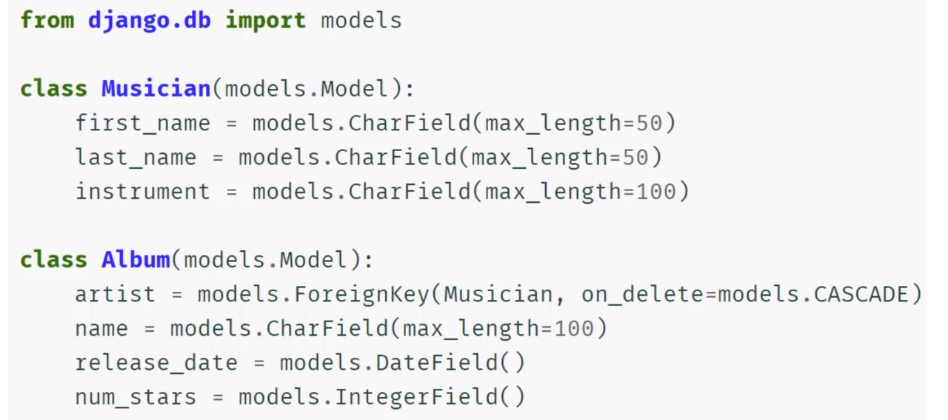

# **Tabel of Contents**
- [**Tabel of Contents**](#tabel-of-contents)
- [**Common Commands \& Code Snippets:**](#common-commands--code-snippets)
- [**Key Django Features**](#key-django-features)
    - [**Additional features not shown in MTV structure above:**](#additional-features-not-shown-in-mtv-structure-above)
    - [**Django Drawbacks:**](#django-drawbacks)
- [**Django Project vs Django App:**](#django-project-vs-django-app)
- [**Views, Routing and URLs:**](#views-routing-and-urls)
    - [Simple Case](#simple-case)
- [**Templates:**](#templates)
- [**Passing variables into an html template / filters:**](#passing-variables-into-an-html-template--filters)
- [**Django Tags:**](#django-tags)
  - [**`for loops` tags:**](#for-loops-tags)
  - [**`if, elif and else` tags:**](#if-elif-and-else-tags)
  - [**Tags \& URL Names in Templates:**](#tags--url-names-in-templates)
      - [**Registering your app with django:**](#registering-your-app-with-django)
  - [**Block Tags - Template Inheritance:**](#block-tags---template-inheritance)
  - [**Customer Error Templates**](#customer-error-templates)
    - [**Making a custom error template with a different name**](#making-a-custom-error-template-with-a-different-name)
  - [**Static Files:**](#static-files)
- [**Models**](#models)
  - [**Database Overview:**](#database-overview)
  - [**Models \& Databases**](#models--databases)
    - [**Django Model Key Concepts**](#django-model-key-concepts)
    - [**Connecting models to create relational databases**](#connecting-models-to-create-relational-databases)


<br><br>

# **Common Commands & Code Snippets:**

Find code snippets [here](https://docs.google.com/spreadsheets/d/1Y5z9UxCh-aFkXUYMTqtE2UQR3YHjotAPrqOAKdQTkc0/edit#gid=1802607629)


<br><br>

# **Key Django Features**

- Model-Template-View (MTV) Structure
    - ORM - Object-relational Mapper
    - Models
    - URLs and Views
    - Templates
 
<br>

The basic MTV structure is as follows, with python picking up the server side (back-end) section of the workflow.


<br>

Where using python comes into its own is by applying python logic that works in tandem with the mtv structure to bring additional features. E.g. machine learning algos working with the models etc.


<br>

### **Additional features not shown in MTV structure above:**
  - Authentication
  - Administration

<br>

### **Django Drawbacks:**

  * Django is heavily reliant on idea of a Model; i.e.  a representation of a table in a database. This makes it easy to query data but does mean that you need to understand Models and setting them up for views.

<br><br>

# **Django Project vs Django App:**

  * Django is set up to take advantage of reusable 'apps' within their projects. This means that you can associate all of the required code, models etc. with the specific app that needs it an create a more organized project overall.


<br><br>

# **Views, Routing and URLs:**

### Simple Case
* Creating a simple view in a django app and connecting it to the main site takes three steps:

1. **Create a view within the target app:**
```
   from django.http import HttpResponse

   def simple_view(request):
      return HttpResponse('This is a simple view!')
```
<br>

2. **Add the path within the urls file of the app:**
```
   from django.urls import path
   from . import views

   urlpatterns = [
      path('', views.simple_view)
   ]
```
<br>

3. **Connects the main site's urls file to the apps urls file:**
```
   from django.contrib import admin
   from django.urls import path, include

   urlpatterns = [
      path('admin/', admin.site.urls),
      path('first_app/', include('first_app.urls')),
   ]
```

<br><br>

# **Templates:**

To connect a django app to a project - so that you can create a separate templates section - you would follow the following steps:

1. Setup the Django App
   1. Create App Directory with `manage.py startapp <name_of_app>` command
   2. Create the relevant URLs and Views
   3. Map the app's URLs to the project
   
2. Run the migrate command
   * `python mange.py migrate`
   * Ths command looks inside the INSTALLED_APPS the settings and creates any necessary db tables
   
3. Inside of Django App check the apps.py file created automatically for you and register the AppConfig class to the INSTALLED_APPS inside of settings.py
   
4. Register the app and any db changes with Django by running:
   * `python manage.py makemigrations myapp`
   * Note, this is relevant only when models have been created.
   
5. Run `python manage.py migrate` again to create the model tables in our database.
   * Again, only relevant when we have created models.
   
6. Create a template directory inside your app directory with this structure:
   * my_side
     * my_app
       * templates
         * my_app
           * example.html
   *  The second my_app folder is to ensure django doesn't choose a template with the same name that is actually associated with another app.

<br><br>

# **Passing variables into an html template / filters:**

   * When creating a view that renders to an html template, context can be parsed (rendered) to the template by adding in the 'context' argument. E.g. The following renders the the my_var dict to the variable.html template.

```
   def variable_view(request):

      my_var = {
         'first_name':'Jonny',
         'last_name':'Brownrigg',
         'some_list':['list item 1','list item 2','list item 3'],
         'some_dict':{'inside_key':'inside_value'},
      }

      return render(
         request,
         'my_app/variable.html',
         context=my_var,
         )
```
<br>

   * To use the values parsed to the template. You can use the {{}} notation. In addition, filters can be applied to perform certain 'python inspired' operations on the variables. E.g.

```
   <h1>VARIABLE.HTML</h1>
      <h2>Hello {{first_name}} {{last_name}}</h2>
      <h2>I have used an upper filter to print this name: {{first_name | upper}} {{last_name | upper}}</h2>
      <h2>And a length filter to print this name: {{first_name | length}} {{last_name | length}}</h2>
      <ol>
         <li>{{some_list.0}}</li>
         <li>{{some_list.1}}</li>
         <li>{{some_list.2}}</li>
      </ol>
```
<br>

   * To find more filters & tags - you can search for built in filters and tags in the django documentation. These can become quite complex, for instance grabbing the time that the user accesses something, date formatting or formatting an extract from a db to be consistent (e.g. upper).

<br><br>

# **Django Tags:**

   * Django tags are able to provide further logic at the template in the rendering process
     * This includes a lot of functionality, such as for loops, if-else statements and linking to URLs.

<br>

## **`for loops` tags:**

- for loop tags can be used to loop through items to create html elements such as lists and tables. E.g the following creates a simple ordered list from some_list or from some_dict.

```
   <ol>
      
         <li>{{item}}</li>
      
   </ol>

   <ul>
      
         <li>{{key}}: {{value}}</li>
      
   </ul>
```

- Many more tags can be found in the django documentation.
- When using these to create a table or list etc. reference the docs for best practice.

<br>

## **`if, elif and else` tags:**

- `if, elif and else` tags are extremely powerful due to the logic it allows. For example, by asking questions of the user (e.g. authenticated or not) different pages can be served.
- We can use boolean operators with `if, elif and else` tags. I.e. `==, or, and, not, >=` etc.

```
   
        <p>You are logged in, and your password is {{some_dict.password}}</p>
   
        <p>You are not logged in - your password cannot be displayed!</p>
   
```
- `for loops` and `if, elif and else` tags can be combined to perform more complex operations. E.g.
```
   <ul>
      
         
            <li>Two</li>
         
            <li>{{num}}</li>
         
      
   </ul>
```

<br><br>

## **Tags & URL Names in Templates:**

Links can be created using url names and the URL tag. To do this, you must first register your 'app' with django.

<br>

#### **Registering your app with django:**
- To register the app's namespace, you must add `app_name = <name_of_app>` to your app.urls file. It's best practice to name the app the same as it is in your file structure. Note, the variable must be called `app_name` so that django can find it. E.g. 

```
   from django.urls import path
   from . import views

   ''' Register the app namespace to be used to be used for URL names '''
   app_name = 'my_app'

   urlpatterns = [
      path('', views.example_view, name='example'),
      path('variable/', views.variable_view, name='variable')
   ]
```

Once the app is registered, a url tag with can  be used to create a link. E.g.

```
   <h2>
      <a href="">Click me to go to example view rendering the example.html template</a>
   </h2>
```

<br><br>

## **Block Tags - Template Inheritance:**

- To avoid repetition, template inheritance can be leveraged. I.e. Rather than recreating the html content for the top navigation bar or footer of a website on every html template, a block tag can be used.


For example:
1. Having registered a templates folder at the project level by adding the following to the settings.py file:

```
   TEMPLATES = [
      {
         'BACKEND': 'django.template.backends.django.DjangoTemplates',
         'DIRS': [os.path.join(BASE_DIR,'templates')],
         'APP_DIRS': True,
         'OPTIONS': {
               'context_processors': [
                  'django.template.context_processors.debug',
                  'django.template.context_processors.request',
                  'django.contrib.auth.context_processors.auth',
                  'django.contrib.messages.context_processors.messages',
               ],
         },
      },
   ]
```
2. You can create the following 'base' template in the templates folder. The block content tag shows the 'wrapper' that can go around other html templates.

```
   <html lang="en">
      <head>
         <meta charset="UTF-8">
         <meta http-equiv="X-UA-Compatible" content="IE=edge">
         <meta name="viewport" content="width=device-width, initial-scale=1.0">
         <title>Document</title>
      </head>
      <body>

         <h1>THIS IS ABOVE THE BLOCK IN BASE.HTML</h1>

         

         

         <h1>THIS IS BELOW THE BLOCK IN BASE.HTML</h1>
         

      </body>
   </html>
```

3. To inherit the template, you can then use the following code:

```
   

   

      <h1>Example html template</h1>
      <h1>Using URL names to link between app views</h1>
      <h2>
         <a href="">
               Click me to go to go back to the variable view rendering the variable.html template
         </a>
      </h2>

   
```

<br><br>

## **Customer Error Templates**

For custom error templates, it is likely that these will be at the project level. Therefore, would be placed in a project level template folder as above.

1. Create a custom template in the project level templates dir. E.g 404.html.
   - Note, to override a specific error. E.g. 404 you call the html 404.html and place it in the templates dir at the project level. Alternatively, you can do the following:  [link to later bit]
  
2. Turn DEBUG off in settings.py and add ALLOWED_HOSTS

```
# SECURITY WARNING: don't run with debug turned on in production!
DEBUG = False

ALLOWED_HOSTS = ['127.0.0.1']
```

### **Making a custom error template with a different name**

1. Create a project level views.py file. (I.e. in my_site) and create a view.

```
   from django.shortcuts import render

   def my_custom_page_not_found_view(request, exception):
      return render(request,'error_view.html',status=404)
```

2. Add the appropriate handler to the project level urls.py file. I.e.
   - Note, there are numerous handler[errorcode] options that can be viewed in the django docs.

```
   from django.contrib import admin
   from django.urls import path, include

   urlpatterns = [
      path('admin/', admin.site.urls),
      path('my_app/', include('my_app.urls'), name='admin')
   ]


   handler404 = 'my_site.views.my_custom_page_not_found_view'
```

## **Static Files:**
- Most projects will have static files such as images, js or CSS.
- Django can serve these static files through tags instead of using full file path
- The following is a generic method to let your template know the location of any static files.

1. Ensure that static files are installed under the INSTALLED_APPS settings within settings.py. Note this should be there by default.

```
   INSTALLED_APPS = [
      'my_app.apps.MyAppConfig', #added new app
      'django.contrib.admin',
      'django.contrib.auth',
      'django.contrib.contenttypes',
      'django.contrib.sessions',
      'django.contrib.messages',
      'django.contrib.staticfiles',
]
```

2. Ensure that the static url is defined in settings.py. I.e.

```
   # Static files (CSS, JavaScript, Images)
   # https://docs.djangoproject.com/en/4.2/howto/static-files/

   STATIC_URL = 'static/'
```

3. Create a directory called 'static' under and place your static files in there. I.e.
   - my_site/my_app/static/my_app/

4. You can then use the static files as follows:
   - Note, some times you will need to restart the server to view the static files.

```
   

   

   

      <h1>Example html template</h1>
      <h1>Using URL names to link between app views</h1>
      <h2>
         <a href="">
               Click me to go to go back to the variable view rendering the variable.html template
         </a>
      </h2>

      <h1>HOW TO MAKE USE OF STATIC:</h1>

      

   
```

<br><br>

# **Models**

- Models allow us to interact with a database with Python and Django.
- This includes CRUD operations:
  - Create
  - Read
  - Update
  - Delete
- THis section will explore how to store, retrieve, update and delete data from SQL based DBs using django's built in models tools and functionality.

<br>

## **Database Overview:**

- SQL databases are tabular. I.e. relational data bases.
- NoSQL databases are stored in a key/value pair format.
- Django models are designed to work well with SQL type DBs and so we will focus primarily on them
  - Additional packages can be installed to support NoSQL databases such as MongoDB.

<br>

## **Models & Databases**

- Django models are defined inside a Django app (or proj) models.py file
- THe models class operates on a system which directly converts Python based code into SQL commands.
- Creating a single Model is similar to creating a new table in a DB. Relationships can then be drawn between the DBs various tables.


<br>

- Each DB table has a name and columns, where each column has a specific data type.

### **Django Model Key Concepts**

- **Inherits from the models class**
- **Uses fields to define both data types and data constraints**
  - for example, you may want to require information, like user's email address, in which case you can add a `NOT NULL` constraint. E.g.


### **Connecting models to create relational databases**

- Models can be connected through keys. E.g.

